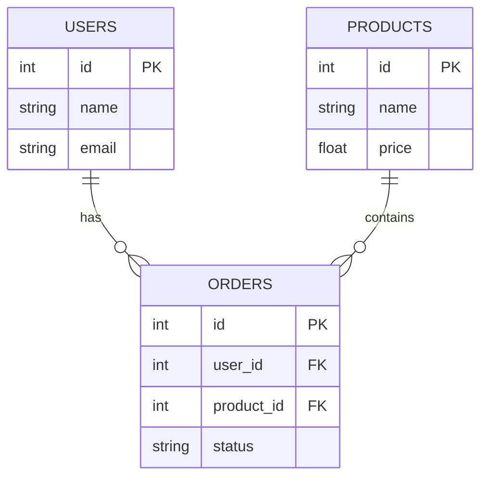
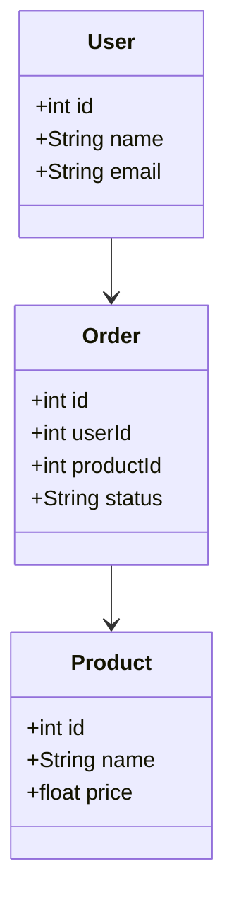
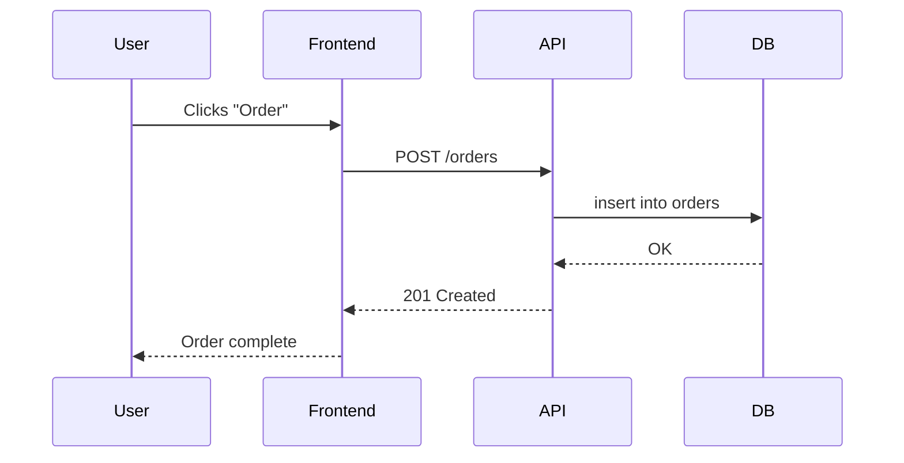

# mermaid-test

# mermaid-test

```mermaid
erDiagram
  USERS ||--o{ ORDERS : has
  PRODUCTS ||--o{ ORDERS : contains

  USERS {
    int id PK
    string name
    string email
  }
  PRODUCTS {
    int id PK
    string name
    float price
  }
  ORDERS {
    int id PK
    int user_id FK
    int product_id FK
    string status
  }
```

```mermaid
classDiagram
  class User {
    +int id
    +String name
    +String email
  }
  class Order {
    +int id
    +int userId
    +int productId
    +String status
  }
  class Product {
    +int id
    +String name
    +float price
  }

  User --> Order
  Order --> Product
```

```mermaid
sequenceDiagram
  participant User
  participant Frontend
  participant API
  participant DB

  User->>Frontend: Clicks "Order"
  Frontend->>API: POST /orders
  API->>DB: insert into orders
  DB-->>API: OK
  API-->>Frontend: 201 Created
  Frontend-->>User: Order complete
```

